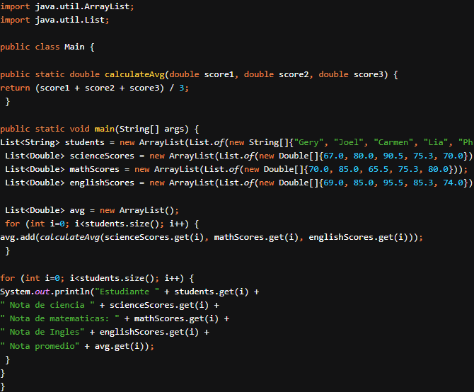
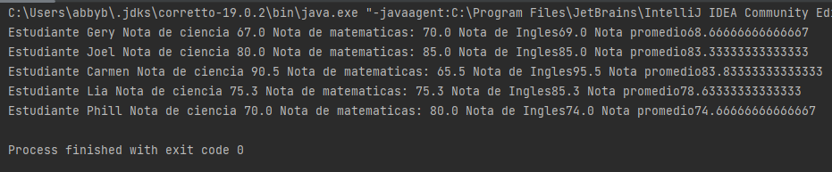
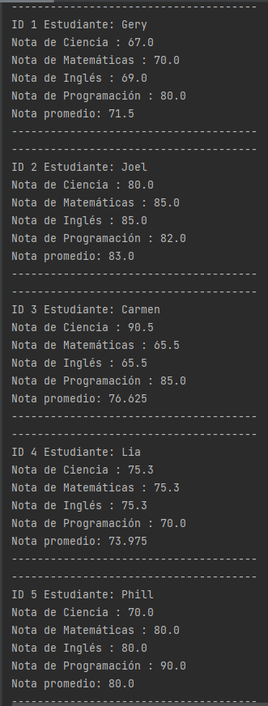
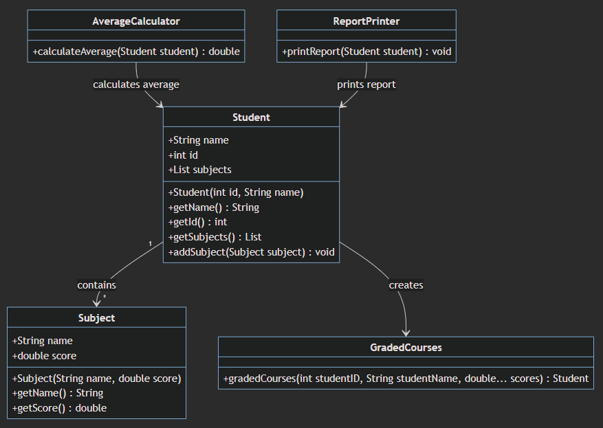

# Actividad #3 - Aplicando buenas practicas

***

Antecedentes: Revisar YAGNI, KISS
***
## Descripción de la actividad:

Tomando como base   el siguiente codigo de ejemplo:

Se pide refactorizar de forma que se pueda agregar una nueva materia, e incluir el ID del estudiante.

Puede recurrir a cualquiera de las buenas practicas de programación.

El objetivo es dejar de crear listas por cada nuevo atributo requerido.
***
## Salida con el código original:

***

## Salida con el código refactorizado:

***

## Diagrama de clases

